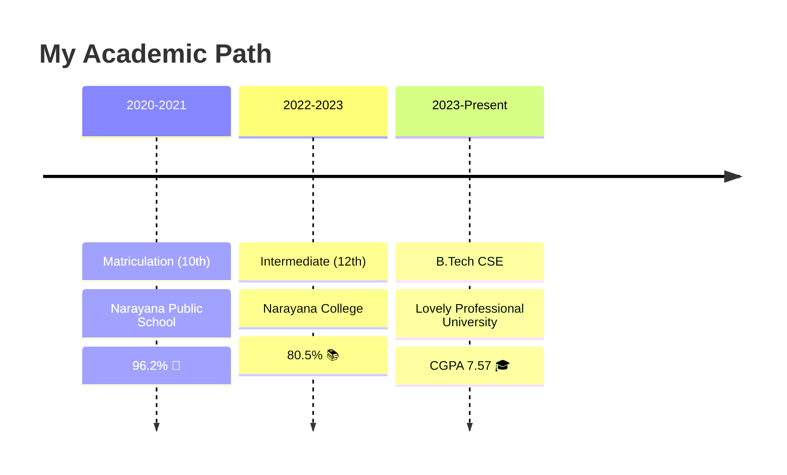

<!-- Animated Header with Gradient -->

<!-- Typing Animation -->

<!-- Animated Badges -->

  
  
  
  

<!-- Social Links with Custom Styling -->

  
  
  
  
  

🌟 About Me
typescriptconst pradeep = {
    pronouns: "He/Him",
    location: "India 🇮🇳",
    education: "B.Tech CSE @ LPU",
    currentFocus: ["Full-Stack Development", "DSA Mastery", "Cloud Computing"],
    communities: ["Open Source", "Competitive Programming"],
    funFact: "I debug with console.log() and I'm proud of it! 😎",
    motto: "Code. Learn. Repeat. 🔁"
};

💼 What I Do
🎨 Frontend Magic • ⚙️ Backend Wizardry • 🗄️ Database Design • 🧠 Problem Solving
I'm passionate about creating elegant solutions to complex problems. With a strong foundation in both frontend and backend technologies, I transform ideas into reality through clean, efficient code.

🛠️ Tech Arsenal

💻 Programming Languages

🎨 Frontend Development

⚙️ Backend & Databases

☁️ DevOps & Cloud

🔧 Tools & Platforms

📊 GitHub Statistics

🏆 Achievements & Trophies

💻 Competitive Programming

🎯 LeetCode Stats

📈 Coding Profile Highlights
PlatformBadgeStatsLeetCodeShow Image200+ Problems SolvedHackerRankShow Image5⭐ Problem SolverCodeChefShow ImageActive ParticipantCodeforcesShow ImageRegular Contests

🚀 Featured Projects

<table>
<tr>
<td width="50%">
🩸 Blood Camp Management
Web Platform for Blood Donation Drives
A comprehensive solution for managing blood donation camps with donor registration, inventory tracking, and campaign management.
Tech Stack:

Show Image
Show Image
Show Image

Show Image
</td>
<td width="50%">
🧠 Mental Health Simulation
Interactive Mental Health Awareness Platform
An engaging platform that simulates mental health scenarios to build awareness and empathy through interactive experiences.
Tech Stack:

Show Image
Show Image
Show Image
Show Image

Show Image
</td>
</tr>
</table>

<b>🔍 More Projects</b>

 

🎮 Game Development Projects - Interactive web-based games
📱 Responsive Web Apps - Mobile-first design implementations
🤖 Automation Scripts - Python-based automation tools
📊 Data Visualization - D3.js and Chart.js projects

🎓 Educational Journey

<table align="center">
<tr>
<th>Institution</th>
<th>Degree</th>
<th>Duration</th>
<th>Score</th>
</tr>
<tr>
<td><b>Lovely Professional University</b></td>
<td>B.Tech - Computer Science</td>
<td>Aug 2023 - Present</td>
<td><b>CGPA: 7.57</b></td>
</tr>
<tr>
<td><b>Narayana College</b></td>
<td>Intermediate (12th)</td>
<td>Mar 2022 - Apr 2023</td>
<td><b>80.5%</b></td>
</tr>
<tr>
<td><b>Narayana Public School</b></td>
<td>Matriculation (10th)</td>
<td>Mar 2020 - Apr 2021</td>
<td><b>96.2% ⭐</b></td>
</tr>
</table>

📈 Contribution Activity

🐍 Watch My Contributions Get Eaten!
<picture>
  <source media="(prefers-color-scheme: dark)" srcset="https://raw.githubusercontent.com/manjunadh248/manjunadh248/output/github-contribution-grid-snake-dark.svg">
  <source media="(prefers-color-scheme: light)" srcset="https://raw.githubusercontent.com/manjunadh248/manjunadh248/output/github-contribution-grid-snake.svg">
  
</picture>

💡 Random Dev Quote

Show Image

🎯 Current Goals for 2025

 🎯 Solve 500+ DSA problems across platforms
 🚀 Contribute to 10+ open source projects
 📚 Master System Design & Architecture
 ☁️ Get AWS Solutions Architect certification
 🌟 Build and launch a SaaS product
 🤝 Mentor 50+ developers in their coding journey

🤝 Let's Connect & Collaborate

💌 Get in Touch
<table>
<tr>
<td align="center" width="33%">
📧 Email
simanju2877@gmail.com
</td>
<td align="center" width="33%">
📱 Phone
+91 8074153775
</td>
<td align="center" width="33%">
💼 LinkedIn
Connect with me
</td>
</tr>
</table>
🌐 Find Me Online

  
  
  
  
  

💭 A Little About My Journey

"Started with 'Hello World', now debugging production servers at 3 AM. The journey from semicolons to microservices has been incredible. Every bug fixed is a lesson learned, every feature shipped is a victory celebrated. Here's to writing cleaner code and building better solutions! 🚀"

📊 Profile Stats

  
  
  

⚡ Fun Facts About Me
🎮 Love coding challenges as much as gaming
☕ Coffee-powered developer (5 cups/day minimum!)
🎵 Code better with lo-fi beats in the background
📚 Always learning something new
🌙 Night owl - best code written after midnight
💪 Believe in consistency over intensity

🎨 Interests Beyond Code
🎸 Music • 📷 Photography • ✈️ Travel • 📖 Reading • 🏃 Fitness • ♟️ Chess

💡 "Always open to exciting collaborations and opportunities!"
✨ "Let's build something amazing together!"

<!-- Animated Footer -->

